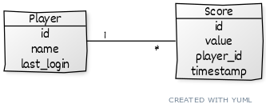
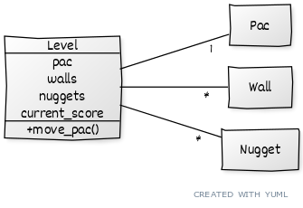
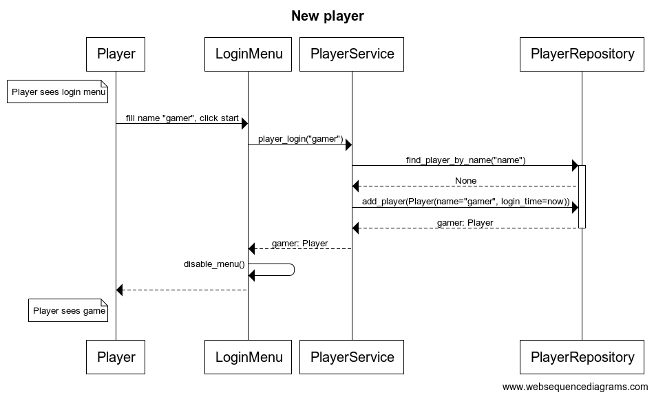
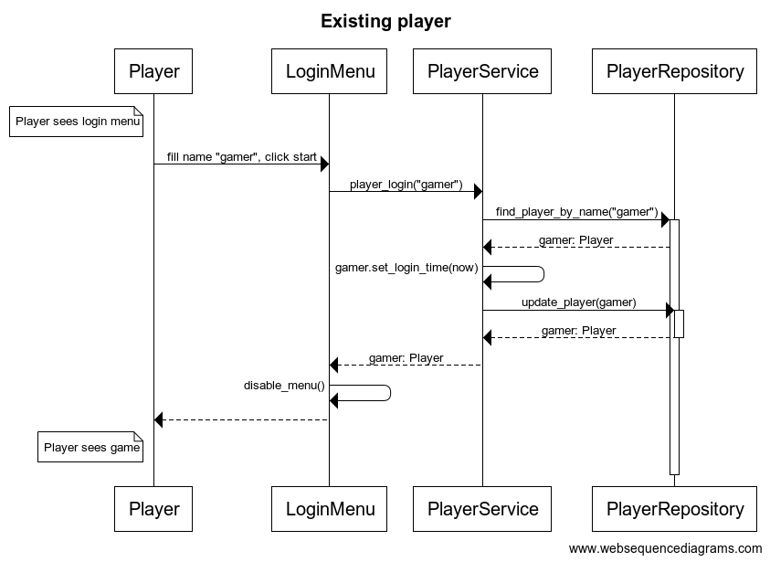

# Arkkitehtuuri

## Tietomalli

Kuvassa on sovelluksen persistoima data luokkakuvauksena. Sovelluksessa on pelaajia, joihin liittyy pelituloksia, ja nämä molemmat tallennetaan. Pelaajilla ei ole muuta rajoitetta kuin että nimi on yksilöllinen, eli kahta samaa pelaajanimeä ei voi rekisteröidä.

## Sovelluslogiikkaa

Kuvassa sovelluksen logiikan kannalta olennaisin kokonaisuus eli taso ja siinä vaikuttavat entiteetit. Taso tietää sisällään olevat entiteetit ja tason julkista metodia `move_pac` kutsutaan liikuttamaan Pacia. Taso myös tietää senhetkisen pistetilanteen, koska sen täytyy sitä pystyä manipuloimaan pelitapahtumien perusteella.

## Kirjautumistoiminnallisuus

Alla on esitetty uuden ja olemassa olevan pelaajan kirjautuminen. Omalle koneelle ladattavan pelin ollessa kyseessä ei ollut mielekästä lähteä luomaan salasanoja, vaan pelaaja kirjautuu hyväksi katsomallaan nimimerkillä ja mikäli tällaista nimimerkkiä ei ole, se luodaan. Mikään ei käytännössä estä pelaamasta jonkun toisen pelaajan mahdollisesti käyttämällä nimimerkillä.

Uuden pelaajan kirjautumisen sekvenssikaavio.

Olemassa olevan pelaajan kirjautumisen sekvenssikaavio.

