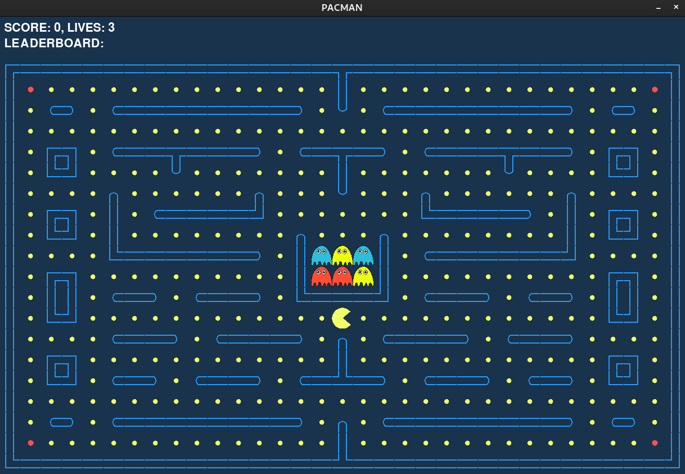
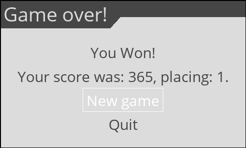

# Käyttöohje

Lataa projektin lähdekoodi releases-sivulta tai kloonaa repositorio koneellesi.


Jos kloonaat repositoriota uudelleen, poista edellisen kerran generoima `data/database.prod.sqlite` tiedosto. Tauluihin on voinut tulla muutoksia versioiden välillä ja migraatiota ei ole.

## Ohjelman käynnistäminen

Asenna ensin projektin riippuvuudet komennolla:
```sh
poetry install
```

Sen jälkeen käynnistä peli komennolla:
```sh
poetry run invoke start
```

## Kirjautuminen

Pelin alussa pelaajaa pyydetään luomaan pelaajatunnus. Käyttäjätunnukseen tarvitaan 1-10 normaalia aakkosta ja/tai numeroa.


Jos yrittää kirjautua käyttäjätunnuksella, joka ei täytä vaatimuksia (1-10 alfanumeerista merkkiä, ei ääkkösiä) näytetään seuraava virheviesti.


## Kirjautumisen jälkeen

Peli alkanee. Kenttä näyttää allaolevan kuvan mukaiselta. Pacin suu liikkuu kiinni ja auki ja vihollisten värit arvotaan pienestä joukosta kentän alkaessa.



Jos pelaaja saa kerättyä kaikki nugetit näytetään seuraava menu, josta näkee saavutetut pisteet ja voi valita pelaavansa uudelleen tai lopettaa.

