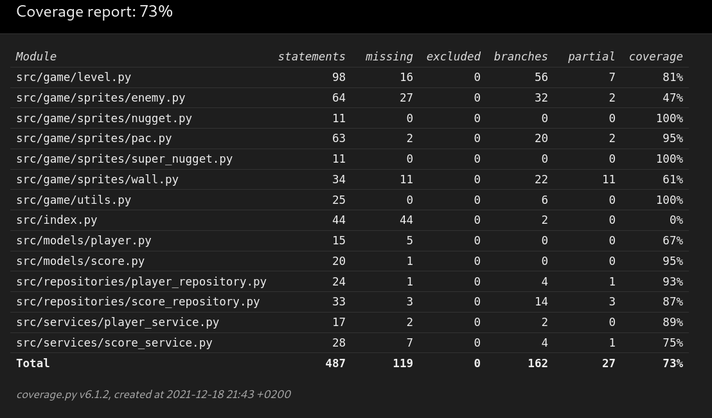

# Testausdokumentti

Ohjelman testit koostuvat yksikkötesteistä ja useampia luokkia yhdessä testaavista integraatiotesteistä.

## Testausarkkitehtuuri

Peliluokista järein on `Level`, jota testataan kohtuullisen kattavasti testiluokissa `TestLevelWithoutEnemy` ja `TestLevelWithEnemy`. Erottelu tehty luokkatasolla selkiyttämään testikontekstia vaikka poikkeaakin hieman nimeämiskonventiosta. `PlayerRepository` ja `PlayerService` sekä `ScoreRepository` ja `ScoreService` -luokkia testataan vastaavilla `Test` -etuliiteluokilla. Näissä käytetään testiajoon initialisoitua tietokantaa. Spritejä testataan myös yksikkötestitasolla jonkin verran, kuten myös persistoituja entiteettejä `Player` ja `Score`.

## Testikattavuus

## Järjestelmätestaus

Käyttöliittymätasoa ei ole testattu automatisoidusti. Järjestelmätason testaus on suoritettu manuaalisesti eikä manuaalisia testitapauksia ole dokumentoitu. Vaatimusmäärittelyn mukaiset toiminnallisuudet on testattu manuaalisesti.