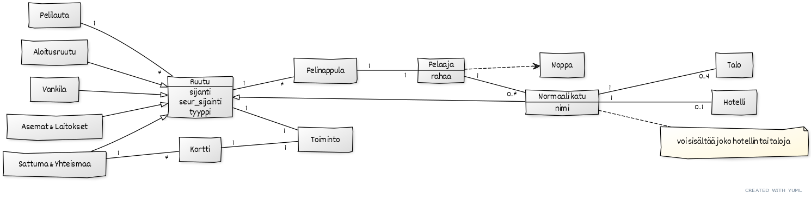

# Tehtävä 2

Laajennokset tehtävään 1:

Ruutuja on eri tyyppejä, joista jokainen tietää oman sijaintinsa ja tyyppinsä. Täten Pelilauta tietää missä Aloitusruutu ja Vankila (ja muunkin tyyppiset ruudut) sijaitsevat.

Jokaiseen ruutuun liittyy jokin toiminto, jota tässä kuvataan myös luokkana.

Sattuma- ja yhteismaa tyyppisellä ruudulla on kortteja joihin liittyy toiminto.

Pelaaja voi omistaa normaaleja katuja.

Normaaleille kaduille voi rakentaa korkeintaan 4 taloa tai yhden hotellin.